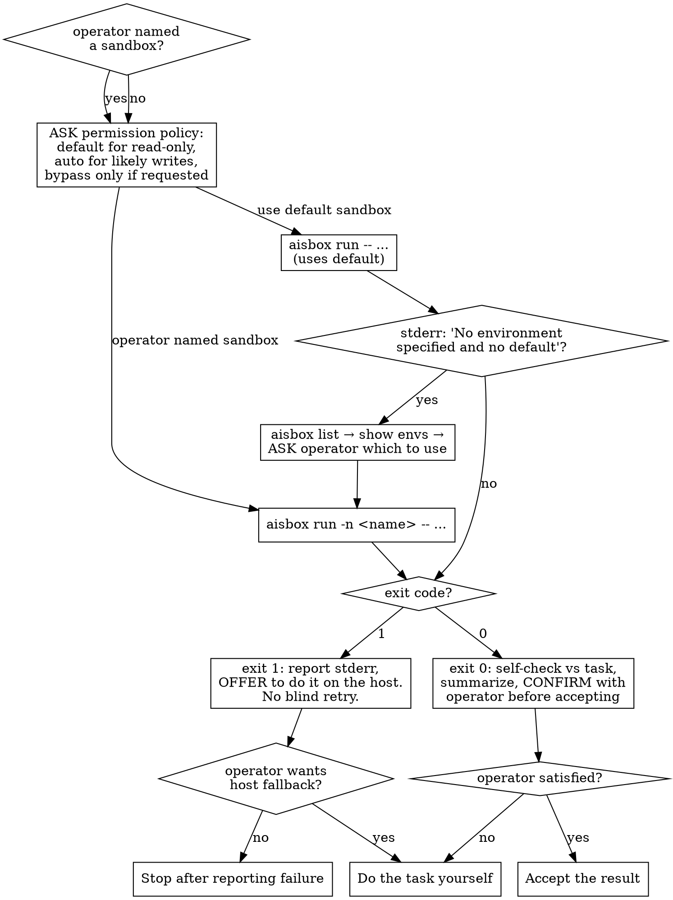

# Delegating to an aisbox Coagent

## Overview

`aisbox run` executes a one-shot AI agent ("coagent") inside a disposable Docker
container that shares **no** config or credentials with the host. This skill
hands a roughly-specified task to a coagent, judges the result, and falls back
to doing it yourself if the coagent fails or underdelivers.

**Core principle:** The operator owns the decisions that matter — *what the
sandbox can see*, *which permission policy to use*, and *whether the result is
good enough*. Never make them silently.

## When to Use

- The operator **explicitly** asks to delegate / hand off / offload to a
  coagent or to aisbox.

**When NOT to use:**
- The operator did not ask for delegation. Just do the task yourself.
- The task needs back-and-forth — `aisbox run` is one-shot (`claude -p` style),
  no multi-turn conversation.
- Setting up, authenticating, or configuring sandboxes (that's the operator's
  job via `aisbox create`/`start`).

## Quick Reference

| Need | Command |
| --- | --- |
| Run on the default sandbox | `aisbox run -- "<prompt>"` |
| Run on a named sandbox | `aisbox run -n <name> -- "<prompt>"` |
| Allow normal write-capable one-shot work | `aisbox run --permission-policy auto -- "<prompt>"` |
| Let the coagent see the current repo | add `--workspace .` |
| List sandboxes | `aisbox list` → `name<TAB>agent<TAB>workspace` |

Pass the prompt as trailing args after `--`. Capture stdout, stderr, and the
exit code separately — the coagent's answer goes to **stdout**; errors go to
**stderr** with exit code **1**.

## Workflow

1. **Build the prompt.** Turn the operator's rough ask into one self-contained
   prompt (no follow-up possible). If it's too vague to hand off blind, tighten
   it and show the operator the prompt before sending.

2. **Choose the workspace — ASK every time.** Ask the operator:
   *"Should the coagent see this repo (`--workspace .`), or run against the
   sandbox's own workspace?"* Mounting `--workspace .` exposes the current
   directory to the sandbox and its outbound network — flag that. Default lean:
   sandbox-only. Never decide this silently.

3. **Choose the permission policy — ASK every time.** Use this heuristic:
   - Use `default` for clearly read-only work: explain code, inspect files,
     summarize, review, or answer questions.
   - Use `auto` for work likely to need normal in-workspace writes: create
     files, edit code, add tests, generate docs, run write-capable formatters,
     or validate write permissions.
   - Mention `bypass` only when the operator explicitly wants maximum autonomy
     or the task needs broad command execution. It disables approval prompts,
     may disable agent sandbox checks, and is only for trusted workspaces and
     scoped prompts. Do not recommend it by default.

   Normal write-capable prompt: *"This looks write-capable, so I recommend
   `--permission-policy auto`. Use that, or keep the agent default?"*

   Bypass prompt when the operator asked for maximum autonomy: *"`bypass`
   reduces agent safeguards and may disable sandbox checks. Use it for this
   trusted, scoped task, or choose `auto` instead?"*

4. **Resolve the sandbox** (see flowchart). If the operator named one, use
   `-n <name>`. Otherwise **do not look up the default** — just run with no
   `-n` and let the CLI use it. Only run `aisbox list` and ask the operator
   *after* a run fails with `Error: No environment specified and no default
   environment is set`. `aisbox list` shows envs but not which is default, so
   don't try to pick from it pre-emptively.

5. **Run it** and capture stdout/stderr/exit code.

6. **Handle the outcome** (see flowchart). On success, self-check the output
   against the task, summarize it, and **confirm with the operator before
   accepting**. On failure, report stderr and offer to do it yourself.

## Common Mistakes

| Mistake | Do instead |
| --- | --- |
| Silently mounting `--workspace .` | Ask every time; flag the exposure. |
| Silently picking a sandbox | Use the default; surface which one. List+ask only when no default. |
| Using `default` for a write task and causing an approval deadlock | Recommend `auto`, explain why, and ask before running. |
| Silently using `auto` or `bypass` | Ask every time; permission policy is operator-owned. |
| Accepting coagent output without a check | Self-check vs the task, then confirm with the operator. |
| Blindly retrying a failed run | Report stderr, offer host fallback. Don't loop on Docker/auth errors. |
| Firing the skill unprompted | Delegation is opt-in. No explicit ask → do it yourself. |
| Putting secrets in the prompt | The prompt and any mounted data may leave the sandbox over the network. |

## Red Flags — STOP

- About to run with `--workspace .` without having asked → ask first.
- About to use `auto` or `bypass` without operator approval → ask first.
- About to delegate a likely write task with `default` after seeing approval-deadlock risk → recommend `auto` and ask.
- About to accept the coagent's answer without operator confirmation → confirm.
- About to retry a failed `aisbox run` more than once → stop, report, offer fallback.
